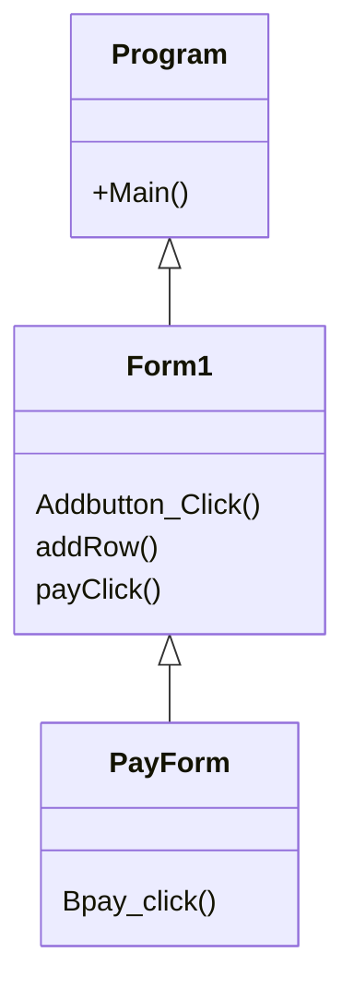

## AShiMamga&Novel
### ความเป็นมาของโปรแกรม
ข้าพระเจ้านั้นชื่นชอบในการอ่านหนังสือการ์ตูนและนิยาย จึงได้นำความชื่นชอบและความรู้ที่มีมาจัดทำโปรแกรมนี้ขึ้นมา
  
### วัตถุประสงค์ของโปรแกรม
เพื่อพัฒนารู้ความสามารถมาประยุกต์ใช้ในการเขียนโปรแกรม

  
### โครงสร้างของโปรแกรม

  
### ผู้พัฒนาโปรแกรม
643450091-3
นาย อชิตพล สุทธิสน
